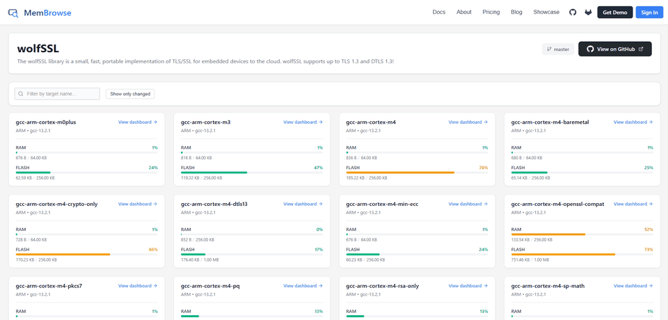

<p align="center">
  
</p>

<h1 align="center">MemBrowse</h1>

<p align="center">
  <a href="https://badge.fury.io/py/membrowse"></a>
  <a href="https://pypi.org/project/membrowse/"></a>
  <a href="https://www.gnu.org/licenses/gpl-3.0"></a>
  <a href="https://pepy.tech/project/membrowse"></a>
  <a href="https://github.com/marketplace/actions/binary-size-memory-footprint-tracking"></a>
  <a href="https://github.com/membrowse/membrowse-action"></a>
</p>

**Catch memory regressions before they ship.** MemBrowse tracks the flash and RAM footprint of your firmware on every commit, comments the memory diff on every pull request, and fails the build when you blow your budget.

It extracts detailed memory information from ELF files and linker scripts — down to symbol-level analysis with source file mapping across multiple architectures. Use the CLI standalone for instant local analysis, or connect it to [MemBrowse](https://membrowse.com) for historical tracking, PR diffs, and CI gating.

> **Get your free API key:** [Sign up](https://membrowse.com/signup) to unlock PR comments, historical tracking, and budget alerts. No account needed to use the CLI locally.

📖 **Full documentation:** [docs.membrowse.com](https://docs.membrowse.com)

<p align="center">
  
</p>

## Firmware teams tracking memory with MemBrowse


<table align="center">
  <tr>
    <td align="center" width="130">
      <a href="https://flipperzero.one"></a><br>Flipper Devices
    </td>
    <td align="center" width="130">
      <a href="https://www.wolfssl.com"></a><br>wolfSSL
    </td>
    <td align="center" width="130">
      <a href="https://nuttx.apache.org"></a><br>Apache NuttX
    </td>
    <td align="center" width="130">
      <a href="https://www.rt-thread.io"></a><br>RT-Thread
    </td>
    <td align="center" width="130">
      <a href="https://docs.tinyusb.org"></a><br>TinyUSB
    </td>
    <td align="center" width="130">
      <a href="https://github.com/SuperTinyKernel-RTOS"></a><br>SuperTinyKernel
    </td>
    <td align="center" width="130">
      <a href="https://github.com/ventZl/cmrx"></a><br>CMRX
    </td>
  </tr>
</table>

<p align="center">…and more.</p>


## Features

- **Architecture Agnostic**: Works with any toolchain that produces ELFs with DWARF debug info (ARM, Xtensa, RISC-V, and more)
- **Source File Mapping**: Symbols are mapped back to their definition source files
- **Memory Region Extraction**: Reads memory layout from GNU LD scripts, IAR ICF files, and SEGGER Embedded Studio `.emProject` files
- **Cloud Integration**: Upload reports to [MemBrowse](https://membrowse.com) for historical tracking, PR diffs, monitoring, and CI gating

## Quick Start

### Analyze your firmware locally (no account required)

```bash
pip install membrowse

membrowse report build/firmware.elf "src/linker.ld"
```

**Example output:**

```
ELF Metadata: build/firmware.elf  |  Arch: ARM  |  Machine: EM_ARM  |  Toolchain: gcc-10.3.1  |  Entry: 0x0802015d  |  Type: ET_EXEC
==========================================================================================================================================================

Region               Address Range                                Size                Used                Free  Utilization
--------------------------------------------------------------------------------------------------------------------------------------------
FLASH                0x08000000-0x08100000             1,048,576 bytes       365,192 bytes       683,384 bytes  [██████░░░░░░░░░░░░░░] 34.8%
  └─ FLASH_START     0x08000000-0x08004000                16,384 bytes        14,708 bytes         1,676 bytes  [█████████████████░░░] 89.8%
     • .isr_vector              392 bytes
     • .isr_extratext        14,316 bytes
  └─ FLASH_TEXT      0x08020000-0x08100000               917,504 bytes       350,484 bytes       567,020 bytes  [███████░░░░░░░░░░░░░] 38.2%
     • .text                350,476 bytes
RAM                  0x20000000-0x20020000               131,072 bytes        26,960 bytes       104,112 bytes  [████░░░░░░░░░░░░░░░░] 20.6%
  • .bss                     8,476 bytes
  • .heap                   16,384 bytes
  • .stack                   2,048 bytes

Top 20 Largest Symbols
======================

Name                                     Address                    Size  Type       Section              Source
--------------------------------------------------------------------------------------------------------------------------------------------
usb_device                               0x20000a30          5,444 bytes  OBJECT     .bss                 usb.c
mp_qstr_const_pool                       0x08062b70          4,692 bytes  OBJECT     .text                qstr.c
mp_execute_bytecode                      0x080392f9          4,208 bytes  FUNC       .text                vm.c
...
```

See the [CLI reference](https://docs.membrowse.com) for JSON output, symbol filtering, uploading, and historical onboarding.

### Track memory in CI (GitHub Actions)

Add a workflow that analyzes each push/PR and comments the diff on pull requests:

```yaml
name: Memory Analysis
on: [push, pull_request]

jobs:
  analyze:
    runs-on: ubuntu-latest
    steps:
      - uses: actions/checkout@v3

      - name: Build firmware
        run: make all # your build commands

      - name: Analyze memory
        uses: membrowse/membrowse-action@v1
        with:
          elf: build/firmware.elf
          ld: "src/linker.ld"
          target_name: stm32f4
          api_key: ${{ secrets.MEMBROWSE_API_KEY }}

      - name: Post PR comment
        if: github.event_name == 'pull_request'
        uses: membrowse/membrowse-action/comment-action@v1
        with:
          api_key: ${{ secrets.MEMBROWSE_API_KEY }}
          commit: ${{ github.event.pull_request.head.sha }}
```

Add your MemBrowse API key as a repository secret named `MEMBROWSE_API_KEY` ([get one free](https://membrowse.com/signup)). The action is [published on the GitHub Marketplace](https://github.com/marketplace/actions/binary-size-memory-footprint-tracking) by a verified creator.

For historical onboarding, custom comment templates, overflow tracking (`limits`), and all action inputs, see [docs.membrowse.com](https://docs.membrowse.com).

### Set it up with Claude Code

If you use [Claude Code](https://claude.ai/code), install the MemBrowse plugin and let it wire everything up for you:

```
/plugin marketplace add membrowse/membrowse-action
/plugin install membrowse@membrowse-marketplace
/membrowse-integrate
```

This analyzes your build, verifies linker scripts, creates the config, and sets up the GitHub Actions workflows.

## Platform Support

MemBrowse works with any toolchain that produces ELF files. Supported memory layout sources:

- **GNU LD** linker scripts (`*.ld`, `*.cmd`), including `INCLUDE`d sub-scripts
- **IAR EWARM ICF** files (`*.icf`)
- **SEGGER Embedded Studio** project files (`*.emProject`)

Format detection is content-based, so the file extension doesn't have to match.

Not getting optimal results? Contact us at support@membrowse.com — we're actively improving MemBrowse.

## Documentation & Support

- **Docs**: [docs.membrowse.com](https://docs.membrowse.com)
- **Issues**: https://github.com/membrowse/membrowse-action/issues
- **Support**: support@membrowse.com

## License

See [LICENSE](LICENSE) file for details.
